***

### **Array  VS  Dynamic Array  VS  LinkedList**

***

* Array

  * 처음 선언할 때 배열의 크기를 고정해야 함

  * 논리적 저장순서와 물리적 저장순서가 일치하고 메모리 공간상에서 연속적으로 존재함

  * 인덱스로 해당 원소에 접근할 수 있어서 데이터 탐색 시간 복잡도는 O(1)

  * 데이터 삽입, 삭제 시 배열에 빈 부분이 생기지 않도록 shift 해줘야하므로 최악의 경우 시간 복잡도는 O(N)

  * Compile time에 메모리에 선언되므로 정적 메모리 할당

    ​          

* Dynamic Array

  * java에서는 ArrayList , C++에서는 Vector

  * 처음 선언할 때 배열의 크기를 고정하지 않는, Array의 불편함을 해소하기 위해 나온 자료구조

  * 설정한 배열 크기를 넘으면 1.5배 크기의 배열을 새로 할당받아 기존 배열에 저장되어 있던 값을 새로 할당한 배열에 복사

  * 인덱스로 해당 원소에 접근할 수 있어서 데이터 탐색 시간 복잡도는 O(1)

  * 데이터 삽입, 삭제 시 배열에 빈 부분이 생기지 않도록 shift 해줘야하므로 최악의 경우 시간 복잡도는 O(N)

    ​          

* LinkedList

  * 논리적 저장순서와 물리적 저장순서가 다르기 때문에 데이터 검색 시 처음 노드부터 일일히 살펴봐야 함. 그러므로 데이터 탐색 시간 복잡도는 O(N)
  * 메모리 공간 상에서 각 노드(데이터 값과 다음 노드의 주소값이 저장되어 있음)들이 연속적으로 이루어져 있지 않고 흩어져 있으며 사용자는 제일 첫번째 노드의 주소값만 알고 있는 상태
  * 데이터 삽입, 삭제 시 데이터 탐색과 더불어 작업을 완료하기까지 걸리는 시간 복잡도는 O(N). 그럼에도 불구하고 Array나 Dynamic Array보다 빠른 성능을 가짐
  * Run time에 메모리에 선언되므로 동적 메모리 할당
  * 단일 링크드리스트는 뒤의 노드만 가리키고 다중 링크드리스트는 앞뒤 노드를 모두 가리킴

​          

삽입과 삭제가 빈번하게 일어난다면 LinkedList를 사용할 것

데이터 검색이 빈번하게 일어난다면 (Dynamic) Array를 사용할 것

​            

***

### **Stack  VS  Queue**

***

* Stack

  * LIFO (Last In First Out) 구조

  * 맨 위에 데이터 삽입(push)  /  맨 위 데이터 삭제(pop)  /  맨 위 데이터 읽기(peek)

  * 데이터 삽입 및 삭제 시 시간 복잡도 O(1)  /  데이터 탐색 시 시간 복잡도 O(N)

  * 함수의 콜  /  문자열 역순 출력  /  연산자 후위 표기법 등에 사용

    ​         

* Queue

  * FIFO (First In First Out) 구조

  * 맨 뒤에 데이터 삽입(Enqueue)  /  맨 위 데이터 삭제(Dequeue)

  * 데이터 삽입 및 삭제 시 시간 복잡도 O(1)  /  데이터 탐색 시 시간 복잡도 O(N)

  * 버퍼  /  BFS 등에 사용

    ​          

2개의 stack으로 queue를 구현하려면 일단 데이터를 모두 stack에 넣은다음 하나씩 빼면서 다시 다른 stack에 넣고 2번째 스택에서 다시 데이터를 하나씩 빼면 된다.

​                  

***

### **Tree**

***

일반 배열도 있는데 데이터를 저장할 때 이 트리 구조를 쓰는 이유가 뭘까?         

위에 있듯이 일반 배열에선 삽입이나 삭제를 하는데 O(N)의 시간이 걸린다.       

하지만 트리 구조에서는 (편향 트리가 아닌 일반적인 트리에서) 시간 복잡도가 O(log N) 으로 줄어든다!       

트리는 비선형 자료구조이며 루트 노드를 제외한 모든 노드는 단 하나의 부모 노드만을 가진다.             

부모 노드(parent)  /  최상위 노드(root)  /  자식 노드(children)  /  자식이 없는 노드(leaf)        

​                  

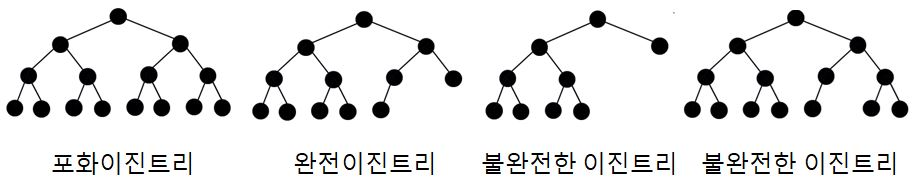</img>

* 포화 이진 트리 (Full Binary Tree) : 모든 레벨이 무조건 꽉 찬 이진 트리. 따라서 높이가 h인 포화 이진 트리에 있는 노드의 수는 2^h - 1 이다. 
* 완전 이진 트리 (Complete Binary Tree) : 왼쪽에서 오른쪽으로 차곡차곡 채워진 이진 트리. 노드의 수가 N개 일 때 완전 이진 트리의 높이는 log2(N)을 계산한 뒤 결과값이 정수가 아닌 경우 올림하면 된다.

​            

* 순회

  * 전위 순회 (preorder)

    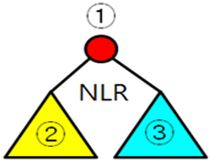</img>

  * 중위 순회 (inorder)

    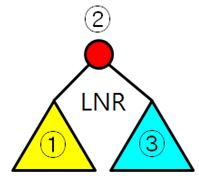</img>

  * 후위 순회 (postorder)

    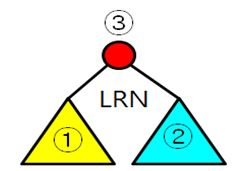</img>

​                 

***

### **Binary Search Tree** (BST)

***

이진 탐색 트리는 linked list에 이진 탐색 알고리즘을 적용시킨 구조이다.        

이진 탐색은 삽입, 삭제가 불가능하지만 탐색에 소요되는 시간 복잡도는 O(log N)이고         

linked list는 탐색에 소요되는 시간 복잡도는 O(N)이지만 삽입, 삭제의 시간 복잡도는 O(1)이기 때문에         

둘의 장점만을 합친 것이 바로 효율적인 탐색 능력도 가지고 데이터 삽입, 삭제도 가능한 이진 탐색 트리 구조인 것이다.     

​         

이 구조에선 데이터를 저장하는 규칙이 있는데       

* 노드에 저장된 값은 유일해야 한다 (굳이 중복을 허용해 탐색 속도를 느리게 할 필요가 없기 때문에)
* 루트 노드의 값이 왼쪽 서브 트리를 구성하는 모든 노드의 값보다 크다
* 루트 노드의 값이 오른쪽 서브 트리를 구성하는 모든 노드의 값보다 작다
* 때문에 중위 순회(inorder) 방식을 사용하면 오름차순으로 정렬된 순서로 값을 읽을 수 있다
* 만약 데이터 삭제를 하게 된다면
  * leaf 노드일 때 : 그냥 삭제
  * 자식 노드가 1개일 때 : 지워진 노드 자리에 자식 노드를 올리기
  * 자식 노드가 2개일 때 : 오른쪽 서브 트리에서 가장 작은 값 올리기 or 왼쪽 서브 트리에서 가장 큰 값 올리기

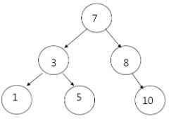</img>

​                

이진 탐색 트리에서 탐색, 삽입, 삭제의 시간 복잡도는 모두 트리의 높이 h에 의해 결정되는 O(h) 이다.       

이 말은 즉 균등 트리일 경우 O(log N)이 되지만 편향 트리일 경우 O(N)이 된다는 소리이다.     

이렇게 되면 속도가 빠른 것이 아니므로 오히려 손해이게 되는데       

이 때문에 트리의 입력, 삭제 단계에 트리의 전체 균형을 맞추는 이진 탐색 트리의 일종인 AVL Tree와 RedBlack Tree가 제안되었다.      

​            

***

### **AVL Tree**

***

 위에서 말했듯 이 구조는 서브 트리의 높이를 적절히 제어해 편향 트리가 되지 않도록 한 BST의 일종이다.      

이 구조의 핵심 개념 중 하나가 바로 Balance Factor(BF) 인데 이는 (왼쪽 서브 트리의 높이 - 오른쪽 서브 트리의 높이) 이다. 서브 트리가 없는 leaf 노드의 경우 BF의 값이 0이고 값이 클수록 불균형 트리인 것이다.        

아래 그림은 각 노드의 BF 값을 나타낸 예시이다.            

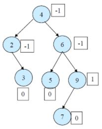</img>

AVL tree는 데이터를 삽입, 삭제하는 과정에서 BF가 일정 값 이상이나 이하로 바뀐 노드를 기준으로 그 서브 트리들의 위치를 rotation 하는 방식으로 트리의 균형을 맞춘다.       

rotation에는 single rotation과 double rotation이 있다. (BF가 2 이상이거나 이하일 때 rotation을 실시한다고 가정)                   

​                  

* single rotation

  *  X 라는 서브 트리에 데이터가 삽입되면 아래 그림처럼 되고 V와 U의 BF는 각각 1,2 가 된다.

    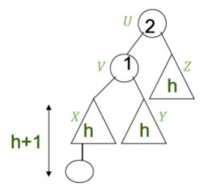</img>

  * U가 rotation 조건에 부합하므로 U의 왼쪽 자식 노드인 V를 기준으로 single rotation을 실시하면 아래와 같아진다. Z를 잡아 당겨 내려서 V를 새로운 루트 노드로 만드는 것이다. (이 경우 single right rotation 이라 한다) 그렇게 되면 U와 V의 BF는 각각 0,0 이 된다.

    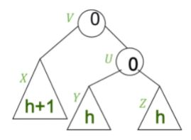</img>

  * single right rotation을 일반화하면 아래와 같다.

    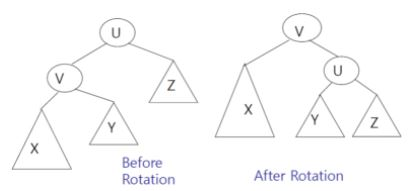</img>

  * right 말고 left rotation도 있다. single left / right rotation을 직관적으로 나타내면 아래 그림과 같다.

    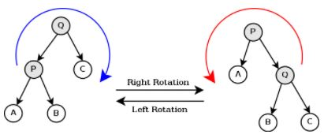</img>

    ​              

* double rotation

  * rotation을 한번만 해서는 원하는 결과를 낼 수 없을 때는 2번 rotation 돌리면 된다.

  * B 라는 서브 트리에 데이터가 삽입되면 아래 그림처럼 되고 U,V,W의 BF는 각각 2,-1,1이 된다. 따라서 U를 루트 노드로 하는 서브 트리가 재구성 대상이 된다.

    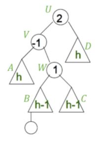</img>

  * 일단 W를 중심으로 left roation을 수행해 A 서브 트리를 잡아 당겨 내려야 한다.

  * 그 다음 다시 W를 중심으로 right rotation을 수행해 D 서브 트리를 잡아 당겨 내려야 한다.

  * 그 결과는 아래와 같다.

    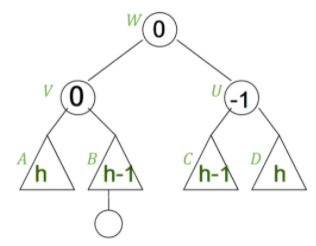</img>

  * left-right double rotation을 일반화하면 아래와 같다.

    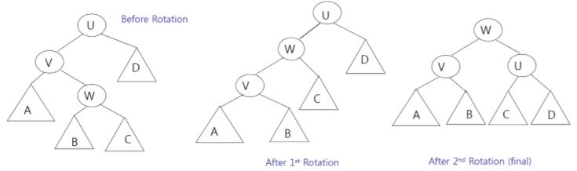</img>

​                

아래와 같은 상황이 주어질 때 4개의 상황에 따라 어떤 rotation을 써야할 지 보자. (U는 BF의 절대값이 2 이상이라 가정)            

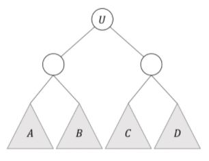</img>

* U의 왼쪽 자식 노드의 왼쪽 서브 트리인 A에 새 노드 삽입 : single right rotation

* U의 왼쪽 자식 노드의 오른쪽 서브 트리인 B에 새 노드 삽입 : left-right double rotation

* U의 오른쪽 자식 노드의 왼쪽 서브 트리인 C에 새 노드 삽입 : right-left double rotation

* U의 오른쪽 자식 노드의 오른쪽 서브 트리인 D에 새 노드 삽입 : single left rotation               

  ​            

  AVL tree는 BST의 일종이기 때문에 트리의 높이가 h라고 했을 때 삽입 연산의 시간 복잡도는 (BST의 시간 복잡도인 O(h) + BF 계산 시간 + rotation 수행 시간) 이 된다.            

  BF 계산 시간은 O(h)이고, 기본적으로 linked list로 구현된 BST의 특성상 rotation은 부모 자식 관계만 변경해주면 되기 때문에 single rotation이든 double rotation이든       

***

### **Heap**

***

힙은 우선 순위 큐를 위해 만들어졌다. 우선 순위 큐는 우선순위의 개념을 큐에 도입한 구조인데 각 데이터들이 우선순위를 가지고 있으며 가장 우선순위가 높은 데이터가 큐에서 제일 먼저 빠져나가는 구조이다.      

주로 시뮬레이션 시스템이나 작업 스케쥴링에 사용되며           

array, linked list, heap으로 구현할 수 있지만 heap으로 구현하는게 시간 복잡도가 가장 낮기 때문에 제일 효율적이다.      

heap은 Complete Binary tree의 형식을 취하고 있기 때문에 삽입, 삭제 시 시간 복잡도가 O(log N)이다.      

즉 heap은 우선 순위에 따라 데이터를 정렬한 tree 인 것이다.        

최대값 및 최소값을 찾아내는 연산을 빠르게 하기 위해 고안된 구조이며 